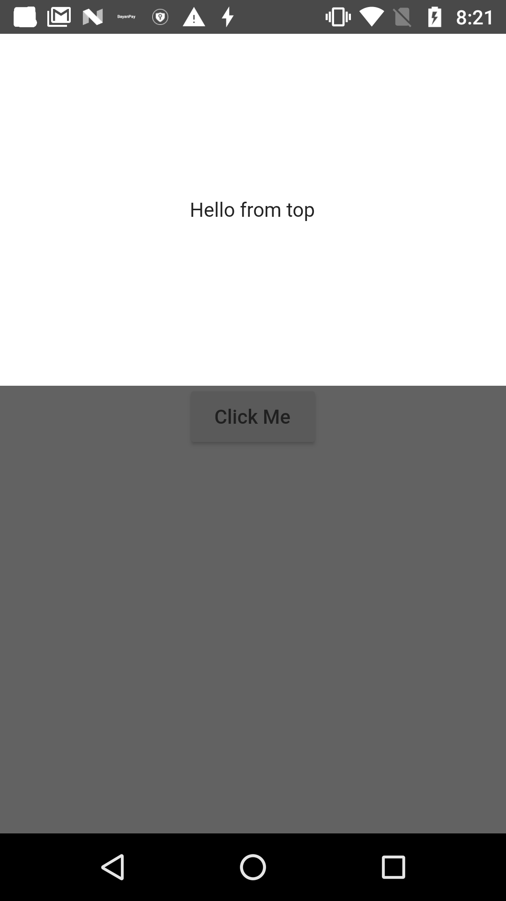

A modal sheet that can also be shown from top of the screen.
Advantages over the original modal sheet:
 - It respects the setState()
 - It intercepts touch events and does not dismisses

## Usage

To use this package, use the following dependency :

```yaml
   dependencies:
     flutter:
       sdk: flutter
     yudiz_modal_sheet:
```

## How to use

```dart
YudizModalSheet.show(
    context: context,
    child: Container(
      color: Colors.white,
      height: 250,
      child: Center(
        child: Text("Hello from top"),
      ),
    ),
    direction: YudizModalSheetDirection.TOP);
```

## Screenshots



## Getting Started

For help getting started with Flutter, view our 
[online documentation](https://flutter.io/docs), which offers tutorials, 
samples, guidance on mobile development, and a full API reference.
